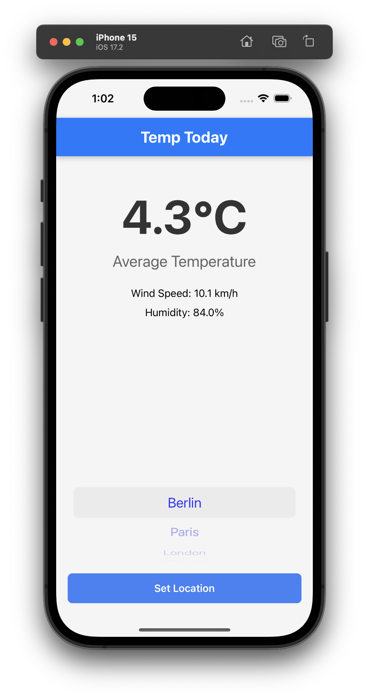
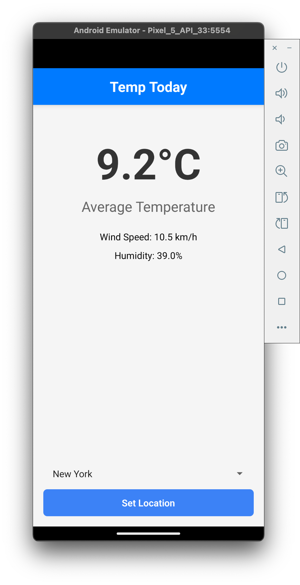

# Temp Today - A React Native Weather App [Starter Project]

<p align="center">
  
</p>

**Temp Today** is a React Native app developed for a hands-on workshop. It allows users to view weather information such as temperature, wind speed, and humidity for selected cities.
The app demonstrates key React Native concepts, TypeScript integration, modern styling methods, API calls, and state management with MobX.

This is the **starter project** for the workshop. The final version with all features implemented is available in the `temp-today` repository.

---

## Features of the finished app

- **Weather Data**:
  - Fetches real-time weather data from the [Open-Meteo API](https://open-meteo.com/).
  - Displays the average temperature, current wind speed, and humidity.
- **City Selection**:
  - Allows users to select a city from a predefined list.
- **Interactive UI**:
  - Dynamically updates weather data based on user selection.
- **Error Handling**:
  - Graceful error handling and retry options when API calls fail.
- **Modern Design**:
  - Styled with a combination of `styled-components` and `NativeWind`.
- **State Management**:
  - Implements MobX for global state management and custom hooks.

---

## Screenshots

<p align="center">
  
  
</p>

---

## Getting Started

### Prerequisites

- **Node.js**: LTS version recommended.
- **Emulators/Devices**:
  - Physical device with [Expo Go](https://expo.dev/client) installed.
  - Android Studio or Xcode for emulators.

---

### Installation

1. **Clone the Repository** and navigate into the project directory.
2. **Install Dependencies** via `npm install`.
3. **Start the Development Server** via `npm start`.
4. **Run the App**: Follow the terminal instructions to open the app in an emulator or on a physical device with Expo Go.

---

## Folder Structure

```plaintext
temp-today/
│
├── .expo/            # Expo-related files (generated automatically)
├── assets/           # Static assets like images, fonts, etc.
├── docs/images/      # Documentation images
├── node_modules/     # Project dependencies (installed via npm)
├── src/              # Application source code
│   ├── components/   # Reusable UI components (e.g., WeatherDisplay, LocationSelector)
│   ├── data/         # Static data (e.g., cityCoordinates)
│   ├── hooks/        # Custom React hooks
│   ├── screens/      # Screens of the app (e.g., MainScreen, SettingsScreen)
│   ├── stores/       # MobX store and related state management
│   ├── types/        # TypeScript type definitions
│   ├── utils/        # Utility functions (e.g., formatMeasurement, helper methods)
│   └── App.tsx       # Root component
│
├── .gitignore        # Git ignore rules
├── app.json          # Expo configuration
├── babel.config.js   # Babel configuration
├── global.css        # Global CSS (tailwind styles)
├── index.ts          # Entry point of the application
├── metro.config.js   # Metro bundler configuration
├── nativewind-env.d.ts # Contains triple-slash directive for NativeWind to extend React Native types
├── package-lock.json # Lock file for npm dependencies
├── package.json      # Project metadata and dependencies
├── README.md         # Documentation and project overview
├── tailwind.config.js # Tailwind CSS configuration
└── tsconfig.json     # TypeScript configuration

```

---

## Key Technologies

- **React Native**: Framework for building mobile apps.
- **TypeScript**: Strongly typed language for scalable and maintainable code.
- **MobX**: Lightweight state management solution.
- **Axios**: For making HTTP requests.
- **Styled-Components**: For component-scoped styling.
- **NativeWind**: Tailwind-like utility styling for React Native.

---

## Features Walkthrough

### 1. Weather Data

- Fetches weather data for the selected city using the Open-Meteo API.
- Displays:
  - Average temperature (calculated from hourly data).
  - Current wind speed.
  - Current humidity.

### 2. City Selection

- A dropdown picker allows users to select a city.
- Available cities include:
  - Berlin, London, Paris, New York, and Tokyo.

### 3. State Management

- Utilizes MobX for managing app-wide state.
- Custom hooks (`useWeatherData`) abstract MobX usage for React components.

---

## Development Notes

### API Details

The app integrates the [Open-Meteo API](https://open-meteo.com/) to fetch weather data. Below is an example of the API call:

```bash
https://api.open-meteo.com/v1/forecast?latitude=52.52&longitude=13.405&current=relative_humidity_2m,wind_speed_10m&hourly=temperature_2m&timezone=Europe/Berlin&past_days=0&forecast_days=1
```

- **Query Parameters**:
  - `latitude` and `longitude`: Coordinates of the selected city.
  - `current`: Retrieves current wind speed and humidity.
  - `hourly`: Retrieves hourly temperature data.
  - `timezone`: Timezone for the selected city.

### Testing

The app includes basic unit tests written with Jest.

To run tests:

```bash
npm test
```

---

## License

This project is licensed under the MIT License. See the [LICENSE](./LICENSE.md) file for details.
